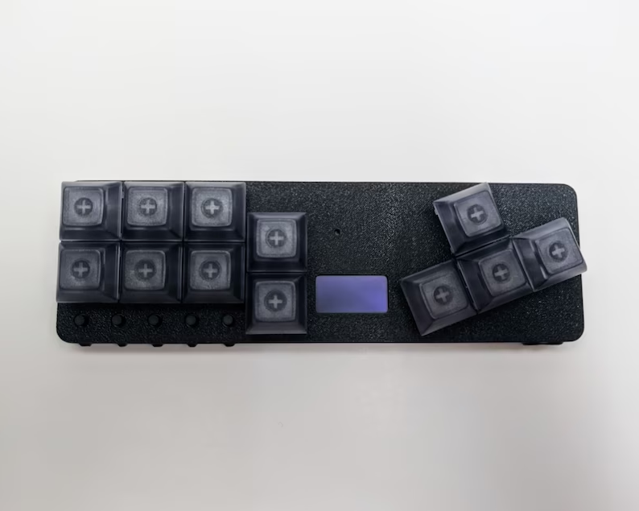

A briefing story of me as a gamer...

In 1988, I got a MSX computer and I liked playing games using its cursor keys.
Since then I've always enjoyed playing games of various genres using a PC keyboard. 
...and a mouse in "point and click", FPS and RTS games...
I never got used to playing with game controllers with the design used from the NES to the PS5.
And I never had any of those video game consoles either. 
However, I always researched game controllers that use mechanical keyboard keys.

And i found these designs below:

[FightBoard](https://thnikk.moe/)

[C64 Joy Key](https://github.com/tebl/C64-JoyKEY)

Based on these designs, I decided to make a version to be used on both Sega Mega Drive and MSX computer ([with the joymega adapter](https://frs.badcoffee.info/hardware/joymega-en.html)).
I made a prototype, by hand, using aluminum sheet and plywood.
Inside there is a mega drive 6-buttons game controller PCB connected by wires to Outemu switches.

In /files folder there is a PDF file with the layout of the prototype made and two other examples. 
One with 3 buttons and another with 6 buttons but with cursor keys inspired by the [Hitbox game controller](https://www.hitboxarcade.com/)

Also there is STL 3d models of the layouts above described and a enclosure base. with 11cm width for the 3-button layout and 14cm width for the 6-button layouts.

