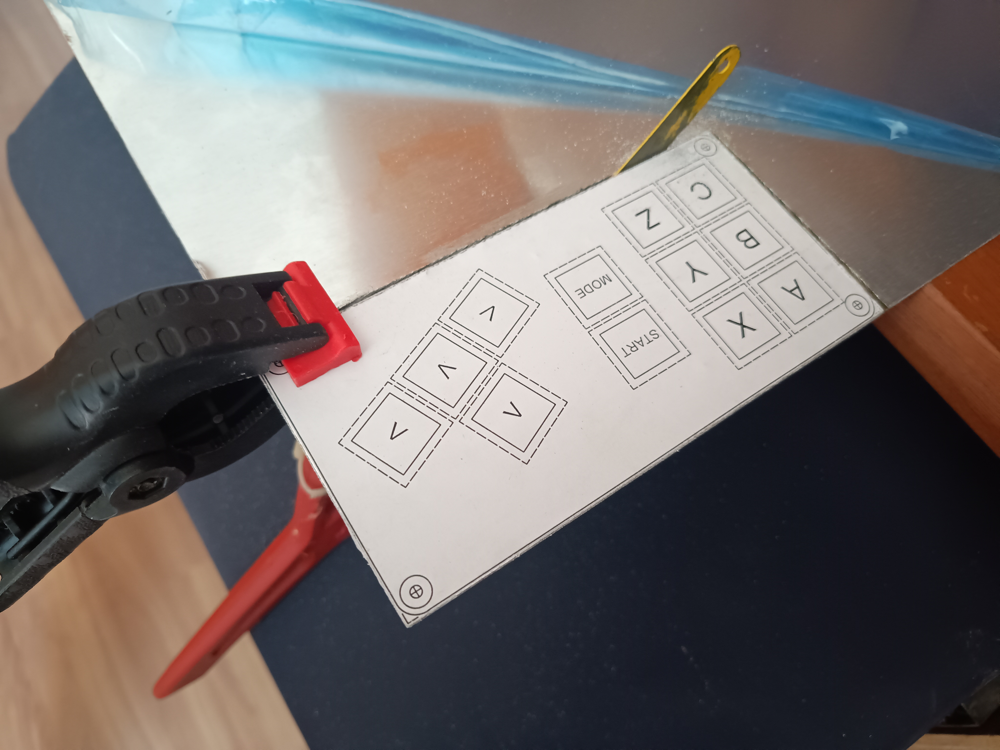

## A briefing story of me as a gamer...

In 1988, I got an MSX computer and I liked playing games using its cursor keys.

Since then, I've always enjoyed playing games of various genres using a PC keyboard. 

...and a mouse in "point-and-click", FPS and RTS games...

I never got used to the design of videogame controllers, from the NES to the PS5.

And I never owned any of those video game consoles either. 

However, I always researched game controllers that use mechanical keyboard keys.

And I found these designs below:

[FightBoard](https://thnikk.moe/)

[C64 Joy Key](https://github.com/tebl/C64-JoyKEY)

Based on these designs, I decided to create a version to be used on both Sega Mega Drive and MSX computer ([with the JoyMega adapter](https://frs.badcoffee.info/hardware/joymega-en.html)).

I made a prototype, by hand, using aluminum sheet and plywood.
Inside there is a Mega Drive 6-buttons game controller PCB connected by wires to Outemu switches.

In [/files](https://github.com/afbento/mec_kbd_game_controller/files) folder there is a PDF and a DWG files with the layout of the prototype made and two other examples. 
One with 3 buttons and another with 6 buttons, but with cursor keys inspired by the [Hitbox game controller](https://www.hitboxarcade.com/)

There are also STL files with 3d models of the layouts above described and two housing options. One with 11cm width for the 3-button layout and another with 14cm width for the 6-button layouts.

Below are some photos of the prototype build process:

I also did some tests playing on MSX: 
[(link)](https://www.youtube.com/shorts/_sk8wwjUQyE)
[(link)](https://www.youtube.com/shorts/MAijYQ0Ai3I)
[(link)](https://www.youtube.com/shorts/h--YPag6jBE)

